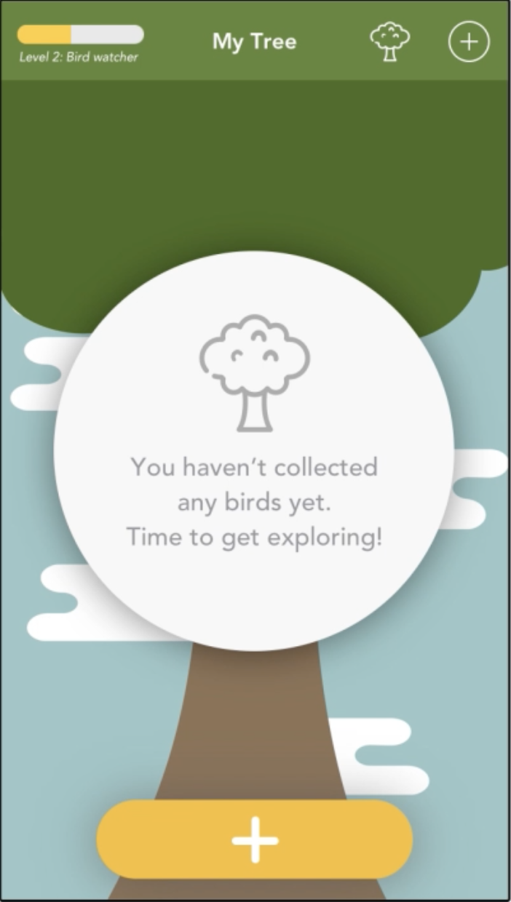
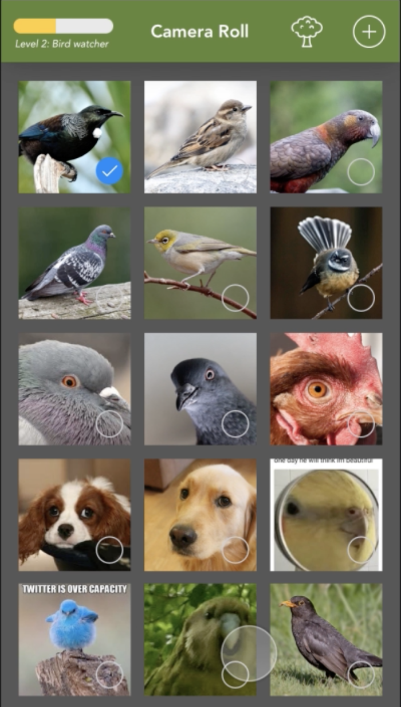
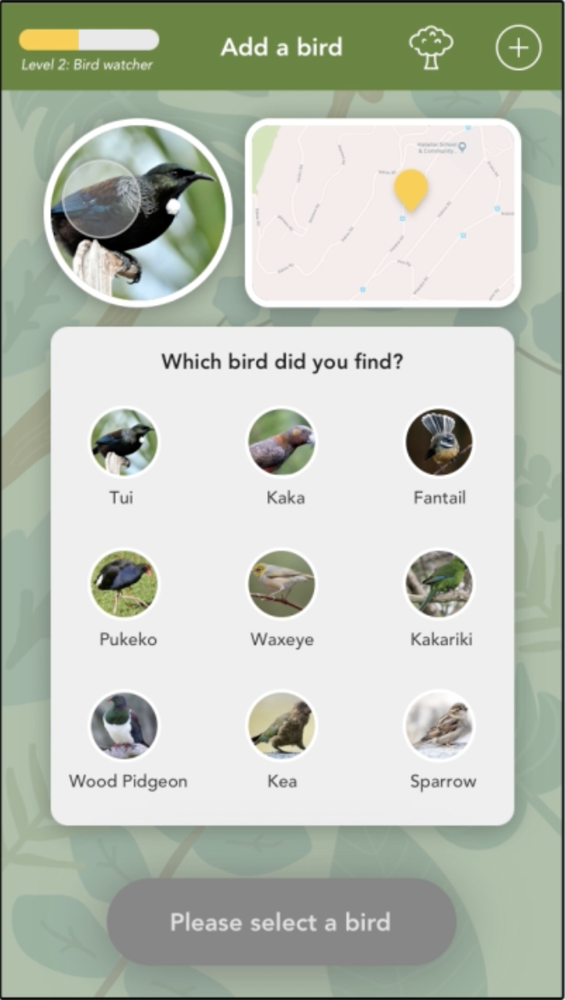
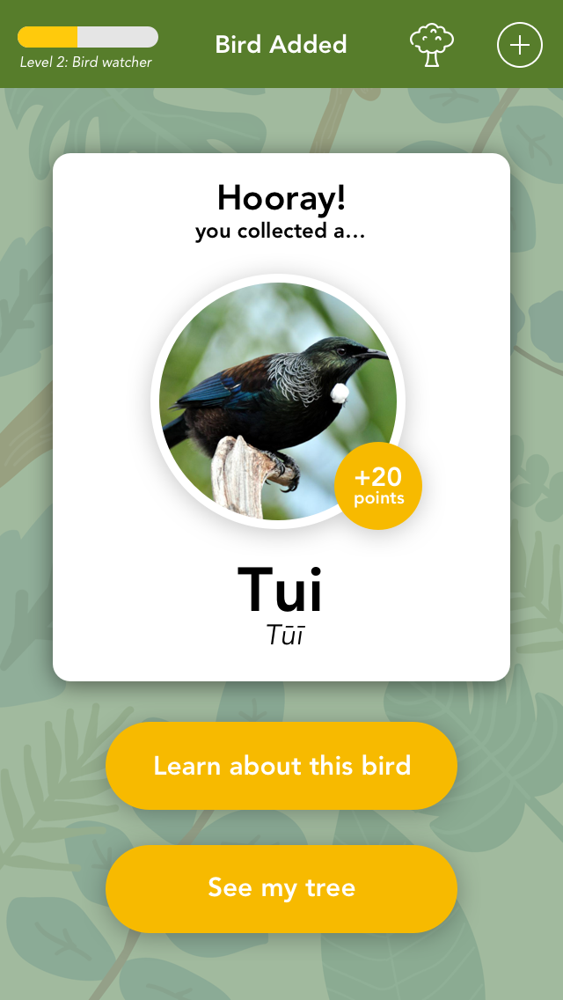
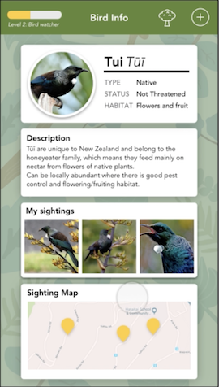
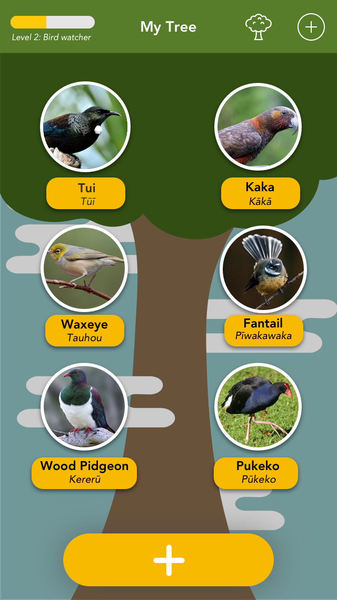

# GO-Native iOS app - (A working iOS concept)

An app my team and I made to engage kids with the environment, finding New Zealand native birds @ Create Camp 2018 (previously known as Hackfest).

### Images

&nbsp;

It's like Pokemon GO but with Birds!

We initially made it in JavaScript but I ported the app myself to iOS.

Designs by [Kate Bennett](https://katydesign.co/projects)

Our concept video: https://youtu.be/bahKq9MTpak
